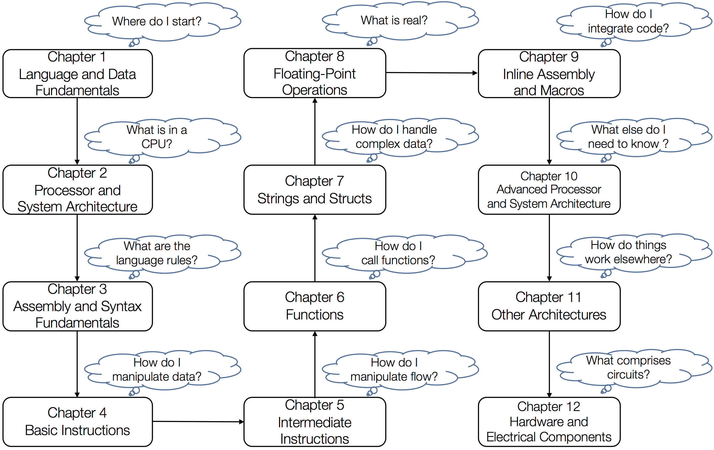

*This page is currently a work in progress as we are in the production stage with expected publication in July 2017.*

# Assembly Programming and Computer Architecture for Software Engineers (APCASE)

#### * Code Repository *

## About
Welcome to the code repository for our book! *APCASE* is a very practical and comprehensive educational text for students, educators, and professionals seeking to learn about Assembly programming and computer architecture. But what makes our book helpful and unique?

- Based on x86 and x86_64 architecture.
- All programming examples are provided for three common assemblers: GAS (Clang/LLVM), MASM, and NASM, which ensures both AT&T and Intel syntax. This allows for learning on any OS platform: Mac, Windows, and Linux.
- Context and examples provided in both 32-bit and 64-bit, both of which are useful for a programmer.
- Code-oriented and detailed overviews of function calls, floating-point operations (x87 through AVX), Inline Assembly, and system calls, all in one book.
- Brief introduction and code examples for other architectures like ARM, AVR, and RISC-V.
- The Appendices provide practical information and guide students in learning Assembly programming.
- Chapter Supplements provide a deeper dive on topics as necessary.
- Links to wikis, developer resources, and videos are provided to assist in further exploration of topics.
- Attention, Programming, and Learning notes are placed throughout the text to guide the reader in beneficial ways.

Is this book for you? Checkout the [Preface](./docs/Preface.pdf), a free [Chapter 3: Assembly and Syntax Fundamentals](./docs/Chapter_3.pdf), and the free [Appendices](#appendices). ***Free Content Coming Soon!!!***

---

### Chapter Roadmap



---

<a name="appendices"></a>
### Appendices
Appendices A, B, E, and I are available for free.

- Introduction to the Appendices
- [Appendix A: Assembly Translation](./docs/Appendix_A.pdf)
- [Appendix B: Environment Setup](./docs/Appendix_B.pdf)
- Appendix C: Disassembly
- Appendix D: Command-Line Debugging Assembly with GDB
- [Appendix E: Linking Assembly and C++](./docs/Appendix_E.pdf)
- Appendix F: Functions and Stack
- Appendix G: Using CPUID
- Appendix H: ASCII and Decimal Arithmetic
- [Appendix I: Intrinsics](./docs/Appendix_I.pdf)


---

### Links

- Book Website (@ProspectPress): [http://www.prospectpressvt.com/titles/hall-assembly-programming/](http://www.prospectpressvt.com/titles/hall-assembly-programming/)
- Brian's Website: [http://www.brianrhall.net](http://www.brianrhall.net)
- Kevin's Website: [http://www.kevinslonka.com](http://www.kevinslonka.com)

---

### Citing this Book

When citing code snippets or other content from the repository or book, please cite the original source:

**BibTeX**:

```
@Book{APCASE,
author = {Hall, B. R. and Slonka, K. J.},
title = {Assembly Programming and Computer Architecture for Software Engineers},
publisher = {Prospect Press},
year = {2017},
address = {Burlington, VT},
isbn = {TBD}
}
```

**APA**:

Hall, B. R., & Slonka, K. J. (2017) *Assembly Programming and Computer Architecture for Software Engineers*. Burlington, VT: Prospect Press.

---


## FAQ

- [How do I assemble and link on Linux?](#linux)

<a name="linux"></a>
#### How do I assemble and link on Linux?
Here are some example `nasm` and `as` commands to assemble and link in Linux. The GAS examples in the book assume you are using Xcode on macOS, which uses Clang/LLVM. So, if you are using GAS on Linux, remember to change the exit routine.

|    Linux     | NASM 32-bit | NASM 64-bit |
|--------------|-----------|-----------|
| Assemble     | `nasm -f elf32 prog.asm` | `nasm -f elf64 prog.asm` |
| Link         | `ld -e _main -melf_i386 -o prog prog.o` | `ld -e _main -melf_x86_64 -o prog prog.o` |
| Exit Routine | `mov eax, 1`<br>`mov ebx, 0`<br>`int 80h` | `mov rax, 60`<br>`xor rdi, rdi`<br>`syscall` |


|    Linux     | GAS 32-bit | GAS 64-bit |
|--------------|-----------|-----------|
| Assemble     | `as --32 -o prog.o prog.s` | `as --64 -o prog.o prog.s` |
| Link         | `ld -e _main -melf_i386 -o prog prog.o` | `ld -e _main -melf_x86_64 -o prog prog.o` |
| Exit Routine | `mov $1, %eax`<br>`mov $0, %ebx`<br>`int $0x80` | `mov $60, %rax`<br>`xor %rdi, %rdi`<br>`syscall` |

